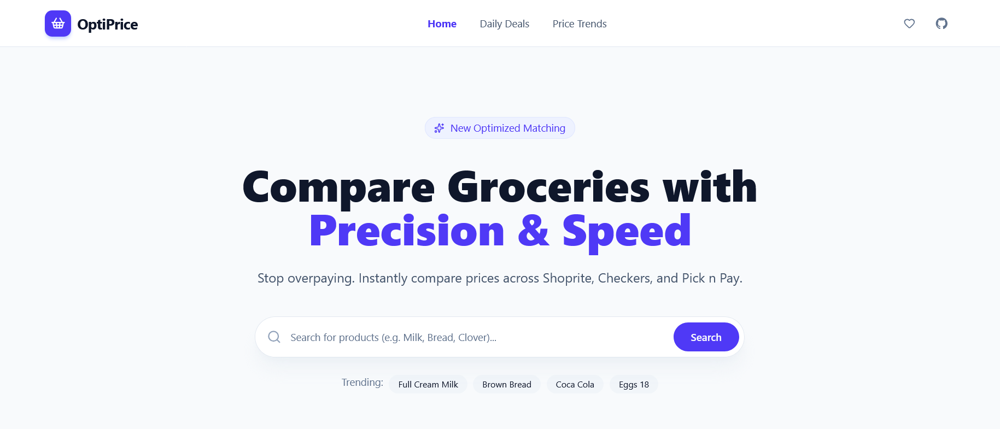

# OptiPrice

**OptiPrice** is a price aggregator platform designed to help South Africans combat inflation 
by finding the cheapest groceries across major retailers: **Checkers**, **Pick n Pay**, and **Shoprite**.



---

## Core Features

### Market Analytics (The "Macro" View)
*   **Essential Basket Index:** A dynamic "Consumer Price Index" (CPI) tracking the total cost of a curated list of household staples across retailers.
*   **Price Volatility Tracking:** Interactive multi-line trend charts showing historical price shifts for every product in the system.

### Smart Deal Discovery
*   **Store Arbitrage:** Real-time identification of "Huge Gaps" where a product is significantly cheaper at a competing store.
*   **Price Drop Detection:** Algorithmic detection of items selling at 15% or more below their historical 30-day average.
*   **Official Promo Ingestion:** Real-time synchronization of "Xtra Savings" and "Smart Shopper" deals directly from retailer backend feeds.

---

## Technical Architecture

### **Backend: Spring Boot 3.4 (Java 21)**
*   **Concurrency Mastery:** Leverages **Java 21 Virtual Threads** to handle massive parallel scraping and thread-pool starvation or blocking I/O.
*   **Event-Driven Pipeline:** Decouples the scraping engine from data normalization using **Spring Application Events** and **Transactional Event Listeners**.
*   **Optimized Persistence:** PostgreSQL with **Spring Data JPA** utilizing **Batch Fetching** and **JOIN FETCH** to eliminate N+1 query problems.
*   **Caching Layer:** **Spring Cache** implementation to optimize expensive analytical SQL joins for market trends.

---

## Tech Stack

| Layer             | Technology                                         |
|:------------------|:---------------------------------------------------|
| **Language**      | Java 21 (Virtual Threads), TypeScript              |
| **Backend**       | Spring Boot 3.4, Spring Data JPA, Spring AI        |
| **Frontend**      | React 18, Tailwind CSS, Shadcn UI                  |
| **Database**      | PostgreSQL 17 + pgvector                           |
| **Scraping**      | Microsoft Playwright                               |
| **Visualization** | Recharts, Date-fns                                 |
| **State Mgmt**    | React Query (TanStack)                             |

---

## Getting Started

### Prerequisites
*   JDK 21
*   PostgreSQL 17+
*   Node.js 18+

### Installation

1. **Clone & Setup Database**
   ```bash
   git clone https://github.com/your-username/OptiPrice.git
   ```

2. **Backend Configuration**
   Update `src/main/resources/application.properties` with your PostgreSQL username and password.

3. **Run Backend**
   ```bash
   ./mvnw spring-boot:run
   ```

4. **Run Frontend**
   ```bash
   cd frontend
   npm install
   npm run dev
   ```

---

## License
This project is licensed under the Apache License - see the [LICENSE](LICENSE) file for details.